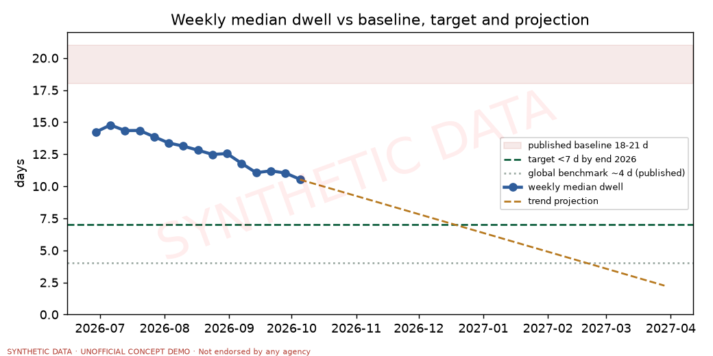
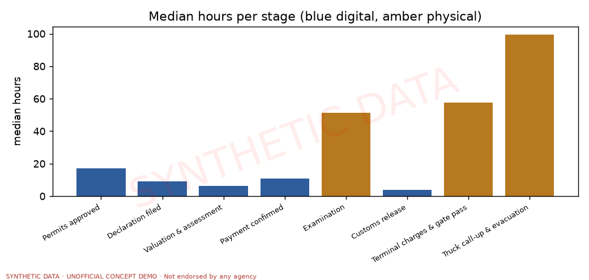
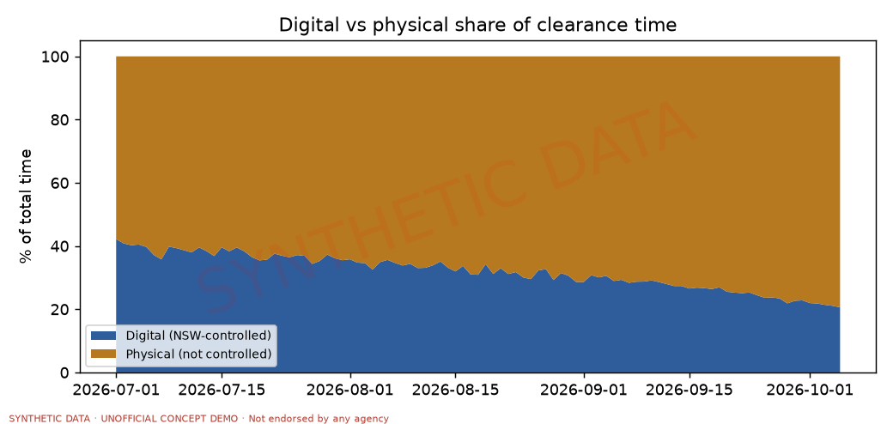
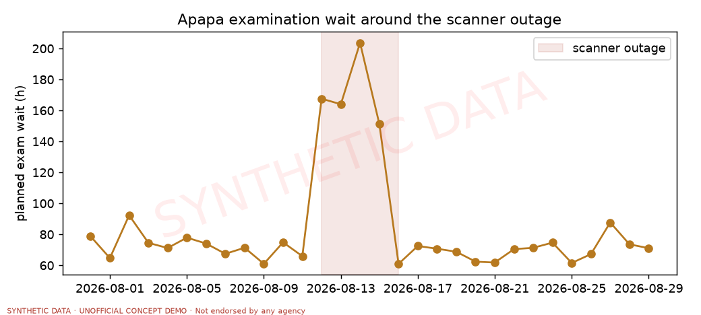
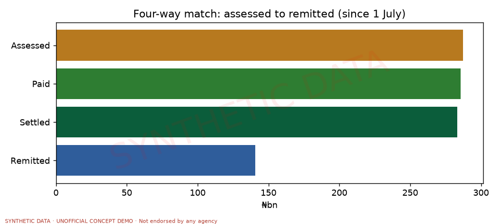
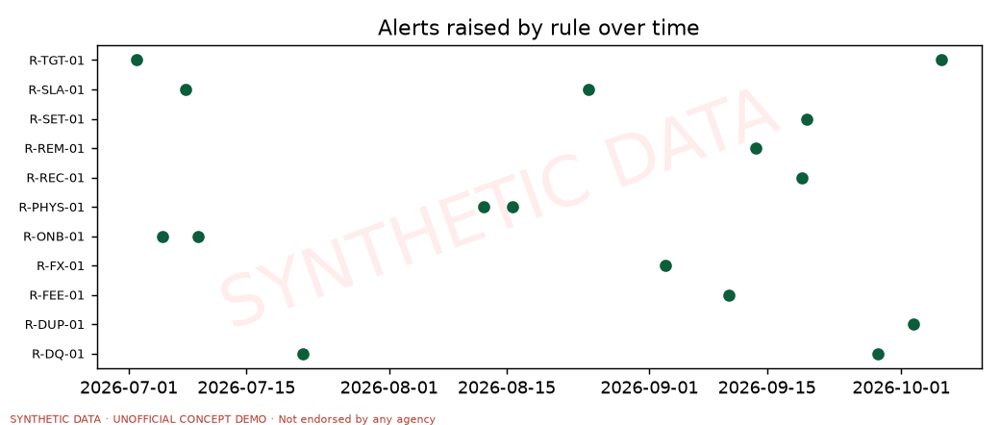
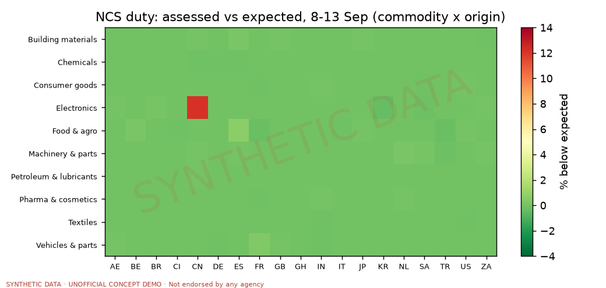
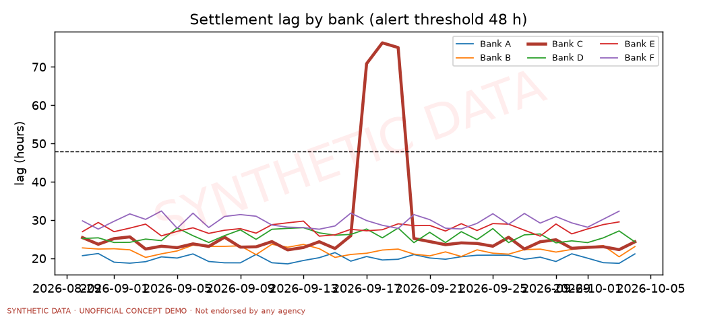
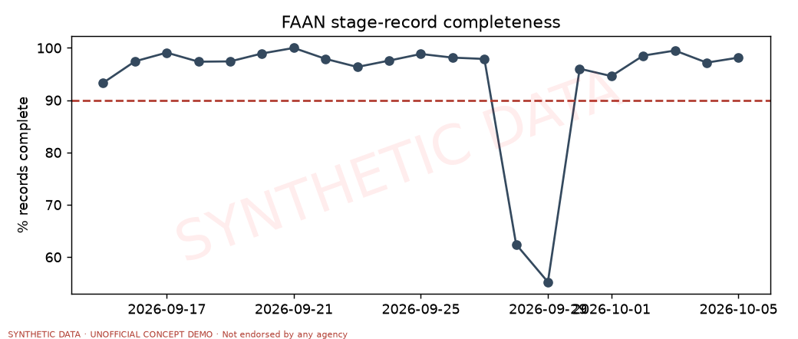

# NSW Intelligence Console: share report

> **SYNTHETIC DATA · UNOFFICIAL CONCEPT DEMO · Not endorsed by any agency**

Data as of **05 Oct 2026 19:00 WAT** · report fingerprint `a06ef4f4812addaf85f04f938d35cd2f7719603968fc9215ae57c4414ee247eb` · model: us.openai.gpt-5.5

## 1. Cover and disclaimer
All data is synthetic. Agency names and logos illustrate structure only; fee names, rates, remittance rules, account codes and identifiers are simulated approximations. Nothing here describes real agency performance. Report generated for a conversation with the NSW secretariat; reproducible with `make report` (fingerprint above, as-of 2026-10-05T18:00:00Z).

## 2. What was built
A live, traceable, supervised financial view across NSW agencies. Needs: **speed** (clearance, target tracker, live feed), **trust** (ledger-backed statements, four-way match, trace, verified assistant), **supervision** (12 rules, reviews, audit, scorecards). Twelve pages: Command Center, Clearance Journey, Entity Explorer, Trace Workbench, Reconciliation, Supervision, Reports, Assistant, Data Quality, Architecture, Admin, Methodology. Run: `make setup probe seed run` (see README).

## 3. Data inventory
| table               |      rows |
|:--------------------|----------:|
| consignments        |    54,019 |
| stage_events        |   525,776 |
| fee_assessments     |   694,008 |
| payments            |    54,265 |
| payment_allocations |   690,034 |
| settlements         |   301,940 |
| journal_entries     |   990,908 |
| journal_lines       | 2,726,230 |
| live_events         |    81,113 |
| alerts              |        16 |

Date range: engine warm-up from 03 Jun 2026, analysis window from 01 Jul 2026 to 05 Oct 2026 19:00 WAT.

**Monthly collections by entity (assessed, ₦bn, September):**

| entity   |   value_bn |
|:---------|-----------:|
| NCS      |      48.21 |
| NRS      |      28.02 |
| NPA      |       9.29 |
| FAAN     |       1.78 |
| NIMASA   |       1.67 |
| NAFDAC   |       1.52 |
| SON      |       1.32 |
| NSW      |       0.63 |
| NAQS     |       0.46 |
| NESREA   |       0.22 |

Origin mix (top 5 by paid): CN 28%, IN 9%, US 8%, AE 7%, NL 6%. Model vs fallback: 203 of 243 plans/profiles from the model. Calibration: every entity's monthly assessed total is within ±15% of the brief's band (test `test_calibration_monthly_totals_within_bands`).

## 4. Quality and test results
# Test summary

Run at 2026-10-05 19:01:13 · 170 s · `134 passed in 168.45s (0:02:48)`

**134 passed, 0 failed** (fast and slow tests; slow tests run against `data/nsw.db`).

| test file | passed | failed |
|---|---|---|
| tests/test_assistant_golden.py | 29 | 0 |
| tests/test_phase0_llm.py | 9 | 0 |
| tests/test_phase1_core.py | 21 | 0 |
| tests/test_phase2_roles.py | 9 | 0 |
| tests/test_phase3_engine.py | 12 | 0 |
| tests/test_phase5_analytics.py | 16 | 0 |
| tests/test_phase5_beats.py | 12 | 0 |
| tests/test_phase6_ui.py | 20 | 0 |
| tests/test_resilience_perf.py | 6 | 0 |

**Assistant evaluation:** 100.0% of 62 base questions; paraphrase robustness 92.5% of 174; zero passing answers with unverified numbers; median latency 0.2 s (cached replays). See `reports/assistant_eval.md`.

**Story beats (B1-B10):**

| beat | name | detector | fired | first detection |
|---|---|---|---|---|
| B1 | Dwell-time improvement trend | R-TGT-01 | yes | 02 Jul 00:00 |
| B2 | Scanner outage at Apapa | R-PHYS-01 | yes | 12 Aug 06:00 |
| B3 | NAFDAC permit backlog | R-SLA-01 | yes | 24 Aug 18:00 |
| B4 | FX movement (NGN weakens ~6% over 5 days) | R-FX-01 | yes | 03 Sep 00:00 |
| B5 | Late remittance (one regulator, 9 days late) | R-REM-01 | yes | 13 Sep 18:00 |
| B6 | Under-assessment cluster (leakage indicator) | R-FEE-01 | yes | 10 Sep 12:00 |
| B7 | Settlement lag at one bank | R-SET-01 | yes | 19 Sep 18:00 |
| B8 | Duplicate payments burst | R-DUP-01 | yes | 02 Oct 12:00 |
| B9 | Data-quality gap (FAAN timestamps missing) | R-DQ-01 | yes | 28 Sep 06:00 |
| B10 | Holiday effect (Independence Day) | volume chart | yes | – |

**Performance:** full backfill about 160 s after plans exist; cached page loads under 2 s (test `test_cached_page_loads_meet_the_two_second_budget`); one simulated day under 5 s offline.

## 5. Model usage and cost
Model `us.openai.gpt-5.5` for every generated-content role (profiles, weekly flow and operations plans, live director, narrator, digest, assistant, storyline drafts, paraphrases). 1778 calls (547 cached; hit rate 31%), 3,643,483 tokens (3,345,832 in, 297,651 out). Estimated cost: tokens only (no price configured).

| role       |   calls |   tokens_in |   tokens_out |
|:-----------|--------:|------------:|-------------:|
| chat       |    1454 |     3168047 |       116755 |
| digest     |       3 |         546 |          490 |
| director   |      11 |        4986 |         4832 |
| flow_plan  |      44 |       44354 |        53620 |
| ops_plan   |     171 |       85412 |        58517 |
| paraphrase |      58 |        4368 |         5703 |
| profile    |      24 |       27956 |        37292 |
| storyline  |      13 |       10163 |        20442 |

## 6. Verified facts pack
- **S01** (speed, score 0.95): Weekly median dwell fell from 14.2 days to 11.0 days between the first and last complete weeks.  
  _evidence:_ clearance.weekly_dwell (consignments by gate-out week) · chart C1
- **S02** (speed, score 0.9): The digital share of total time fell from 42.2% to 36.8%.  
  _evidence:_ clearance.digital_physical · chart C2
- **S03** (speed, score 0.95): Counter-intuitive: digital time per consignment fell 4% (from 145 to 139 hours) while physical time fell only -20% (from 198 to 238 hours), so physical stages now dominate.  
  _evidence:_ clearance.digital_physical per-consignment hours · chart C2
- **S04** (speed, score 0.85): Truck call-up & evacuation is the largest source of delay: 104 hours per consignment, 39% of total time, and it is outside the NSW's control.  
  _evidence:_ clearance.bottlenecks (last four weeks) · chart C3
- **S05** (speed, score 0.6): Stage medians: Truck call-up & evacuation 99 hours; Terminal charges & gate pass 57 hours; Examination 51 hours.  
  _evidence:_ clearance.stage_summary · chart C3
- **S06** (speed, score 0.9): During the Apapa scanner outage the planned exam wait rose from 72 to 170 hours (2.4 times), detected at 12 Aug 06:00 WAT by alert ALT-20260812-00001; about 1378 consignment-days of extra waiting accrued.  
  _evidence:_ stage_events S06 queued rows at NGAPP; alerts R-PHYS-01 · trace: `ALT-20260812-00001` · chart C4
- **S07** (speed, score 0.85): On the current trend median dwell reaches 7 days around 2026-12-18 (status: on track); the trend slope is -0.33 days per week.  
  _evidence:_ forecast.project_to_target · chart C1
- **S08** (speed, score 0.7): Illustrative cost of dwell beyond 7 days over the last four weeks: ₦8.70bn (assumptions editable; illustrative).  
  _evidence:_ clearance.cost_of_delay
- **S09** (speed, score 0.6): Predictability: over the last four weeks median dwell was 11.2 days and p90 18.0 days.  
  _evidence:_ clearance.dwell_table
- **S10** (speed, score 0.55): Against published benchmarks (verify before quoting): current median dwell 11.0 days vs target under 7 days and a global benchmark of about 4 days.  
  _evidence:_ published figures + clearance.weekly_dwell · chart C1
- **S11** (speed, score 0.7): During the NAFDAC permit backlog, planned approval time rose from 32 to 57 hours and the SLA alert ALT-20260824-00001 was raised on 24 Aug.  
  _evidence:_ stage_events S02 queued rows (NAFDAC); alerts R-SLA-01 · trace: `ALT-20260824-00001`
- **S12** (speed, score 0.4): Independence Day (1 October) saw 84 manifests against 358 on the neighbouring weekdays.  
  _evidence:_ consignments by manifest day
- **T01** (trust, score 0.95): Since 1 July the NSW channel assessed ₦287.16bn, collected ₦285.72bn, settled ₦283.06bn to agencies and recorded ₦140.80bn remitted to the Treasury.  
  _evidence:_ reconcile.four_way · chart C5
- **T02** (trust, score 0.7): Collection efficiency was 98.6% and the cost of collection 0.68 naira per ₦100 collected.  
  _evidence:_ reconcile.four_way · chart C5
- **T03** (trust, score 0.6): ₦2.66bn is in transit (paid, not yet settled) across 6 banks; this is timing, not error.  
  _evidence:_ reconcile.in_transit_by_bank
- **T04** (trust, score 0.95): Revenue assurance caught an under-assessment cluster: NCS duty on Electronics from CN was assessed 12.1% below expectation (about ₦24.2m over 6 days); alert ALT-20260910-00001 fired on 10 Sep.  
  _evidence:_ reconcile.leakage_heatmap (NCS-DUTY, 8-13 Sep); alerts R-FEE-01 · trace: `ALT-20260910-00001` · chart C6
- **T05** (supervision, score 0.8): A burst of 14 duplicate payments worth ₦63.2m on 2 October was flagged by alert ALT-20261002-00001 at 12:00 WAT.  
  _evidence:_ payments is_duplicate; alerts R-DUP-01 · trace: `ALT-20261002-00001`
- **T06** (supervision, score 0.85): Bank C settlement lag rose from 24 to 74 hours (T+3); alert ALT-20260919-00002 was raised on 19 Sep 18:00 WAT.  
  _evidence:_ settlement_batches Bank C; alerts R-SET-01 · trace: `ALT-20260919-00002` · chart C7
- **T07** (supervision, score 0.8): One regulator remitted 9 days late (₦418.4m); alert ALT-20260913-00001 was raised on 13 Sep, three days after the due date.  
  _evidence:_ remittances; alerts R-REM-01 · trace: `ALT-20260913-00001`
- **T08** (trust, score 0.85): A two-day data gap at one operator cut record completeness from 98% to 55% and was flagged the same day (alert R-DQ-01).  
  _evidence:_ quality.completeness_trend (FAAN); alerts R-DQ-01 · chart C8
- **T09** (trust, score 0.9): All 990,908 journal entries balance (0 unbalanced) and the consolidated balance sheet balances at ₦433.14bn of assets.  
  _evidence:_ journal_lines integrity query; statements.position('ALL')
- **T10** (trust, score 0.9): Trace in seconds: consignment NSW-202609-NGONN-0000911 was charged by 6 agencies (NCS, NIMASA, NPA, NRS, NSW, SON) totalling ₦2.8m; a statement line traces to journal entries and source documents with totals tying out at every level (L1 = L2: True).  
  _evidence:_ trace.consignment_trace, trace.tie_out · trace: `NSW-202609-NGONN-0000911`
- **T11** (trust, score 0.5): NCS accounts for 52% of collections; the top origin country, CN, supplies 28% of fees.  
  _evidence:_ queries.entity_mix; queries.aggregate by origin
- **T12** (trust, score 0.6): Data confidence scores range from 83 to 99 across agencies.  
  _evidence:_ quality.scorecard
- **T13** (supervision, score 0.7): 16 alerts across 11 rules were raised and each scripted incident was detected.  
  _evidence:_ alerts table · chart C9
- **T14** (trust, score 0.85): The assistant passed 100% of 62 golden questions against an independent oracle and 93% of 174 paraphrases, with every passing answer's numbers verified against tool outputs.  
  _evidence:_ scripts/run_assistant_eval.py
- **T15** (trust, score 0.5): 203 of 243 generated profiles and plans came from the language model; the rest are deterministic fallbacks (warm-up weeks).  
  _evidence:_ generation_runs
- **T16** (supervision, score 0.5): Exception classes: mismatch 9343; duplicate 15; unpaid 345; settled_late 74; orphan_payment 14.  
  _evidence:_ reconcile.exception_summary
- **T17** (trust, score 0.55): The naira weakened 6.2% over five days in early September, raising the naira value of USD fees; alert R-FX-01 recorded it.  
  _evidence:_ fx_rates; alerts R-FX-01
- **T18** (trust, score 0.4): The database holds 54,019 consignments and 2,726,230 ledger lines from the warm-up start to now.  
  _evidence:_ row counts

## 7. Storyline A: Where the time really goes: proof of progress and the last mile
_(drafted by us.openai.gpt-5.5; every number checked against facts.json)_

### Slide 1: The target and why it matters
**Key message:** The current median dwell is improving but remains above the target under 7 days, with material illustrative cost tied to excess dwell.

- Current median dwell is 11.0 days versus a target under 7 days.
- Published benchmark context, to verify before quoting, is about 4 days globally.
- Over the last four weeks, median dwell was 11.2 days and p90 was 18.0 days.
- Illustrative cost of dwell beyond 7 days over the last four weeks is ₦8.70bn, with mean excess days of 4.9 days.

_Speaker notes:_ The data in this pack is synthetic and should be read as decision-support evidence. The central point is that progress is visible, but the last mile to under 7 days still matters operationally and financially. Benchmark comparisons should be verified before external quotation.

_Evidence: S08, S09, S10_

### Slide 2: The trend: weekly median dwell July to now
**Key message:** Weekly median dwell has fallen from 14.2 days to 11.0 days, showing clear progress on the current trend.

- Weekly median dwell fell from 14.2 days to 11.0 days between the first and last complete weeks.
- The recorded change is -22.5%.
- The trend slope is -0.33 days per week.
- On the current trend, median dwell reaches 7 days around 2026-12-18, with status: on track.

_Speaker notes:_ The trend line shows that the system is moving in the right direction. The latest complete week is at 11.0 days, and the projection points to 7 days around 2026-12-18 if the current trend is sustained. The emphasis should be on maintaining the rate of improvement while addressing the largest remaining sources of delay.

_Evidence: S01, S07_

### Slide 3: Anatomy of delay: stage waterfall, digital vs physical, hand-off waits
**Key message:** The largest remaining delay is concentrated in physical and hand-off stages, especially Truck call-up & evacuation.

- Truck call-up & evacuation accounts for 104 hours per consignment and 39% of total time.
- Truck call-up & evacuation is outside the NSW's control.
- Stage medians are 99 hours for Truck call-up & evacuation, 57 hours for Terminal charges & gate pass, and 51 hours for Examination.
- The latest physical time is 238 hours, compared with latest digital time of 139 hours.

_Speaker notes:_ The waterfall shifts the discussion from aggregate dwell to where time is actually spent. The largest stage is a physical flow outside NSW control, so resolution requires cross-process coordination rather than a narrow system fix. Terminal charges & gate pass and Examination are also material hand-off points in the synthetic evidence.

_Evidence: S03, S04, S05_

### Slide 4: The shift: digital share falling while physical dominates
**Key message:** Digital time is taking a smaller share of total time, while physical stages now dominate the end-to-end dwell picture.

- The digital share of total time fell from 42.2% to 36.8%.
- Digital time per consignment fell 4%, from 145 hours to 139 hours.
- Physical time moved from 198 hours to 238 hours.
- The verified evidence states that physical stages now dominate.

_Speaker notes:_ The counter-intuitive finding is that a falling digital share does not automatically mean the total dwell problem is solved. Digital time per consignment improved, but the physical component remains larger in the latest view. This points the next phase toward physical-flow bottlenecks and interfaces between stages.

_Evidence: S02, S03_

### Slide 5: Case study: the Apapa scanner outage
**Key message:** The Apapa scanner outage shows how a single disruption can rapidly convert into large volumes of extra waiting time.

- During the outage, planned exam wait rose from 72 hours to 170 hours.
- The increase was 2.4 times.
- The issue was detected at 12 Aug 06:00 WAT by alert ALT-20260812-00001.
- About 1378 days of extra consignment waiting accrued.

_Speaker notes:_ This synthetic case study illustrates why early warning and fast operational response matter. The alert captured the event at 12 Aug 06:00 WAT, while the downstream effect accumulated as 1378 days of additional consignment waiting. The purpose is not to assign blame, but to show the value of resilience around critical inspection capacity.

_Evidence: S06_

### Slide 6: Projection and cost of delay
**Key message:** The current trajectory is on track for 7 days around 2026-12-18, but every period above target carries an illustrative cost.

- Projection status is on track.
- Median dwell reaches 7 days around 2026-12-18 on the current trend.
- The trend slope is -0.33 days per week.
- Illustrative cost of dwell beyond 7 days over the last four weeks is ₦8.70bn.
- Mean excess days over the last four weeks are 4.9 days.

_Speaker notes:_ The projection gives senior officials a concrete date to manage against. The cost figure is explicitly illustrative and assumptions are editable, so it should be used to frame choices rather than as an audited charge. The operational priority is to protect the current slope while reducing the physical-stage bottlenecks that keep dwell above target.

_Evidence: S07, S08_

### Slide 7: What we need to make it real
**Key message:** To make the 7-day trajectory real, the next actions should focus on the biggest physical delays, disruption response, and weekly accountability against the same measures.

- Prioritise Truck call-up & evacuation, which is 104 hours per consignment and 39% of total time.
- Target the largest stage medians: 99 hours for Truck call-up & evacuation, 57 hours for Terminal charges & gate pass, and 51 hours for Examination.
- Use alert-led response for disruptions, as shown by ALT-20260812-00001 and the 1378 days of extra waiting during the Apapa scanner outage.
- Track weekly median dwell against 7 days, with the current trend at -0.33 days per week and status: on track.
- Keep p90 visibility alongside the median, given the last four weeks show 11.2 days median and 18.0 days p90.

_Speaker notes:_ The evidence supports a focused last-mile agenda rather than a broad restatement of the problem. The biggest opportunities are in physical flow, hand-off waits, and resilience to operational disruptions. A simple weekly cadence around median, p90, and the major stage delays can keep the programme aligned to the 7-day target.

_Evidence: S04, S05, S06, S07, S09_

## 8. Storyline B: One window, one truth: every naira traceable and supervised
_(drafted by us.openai.gpt-5.5; every number checked against facts.json)_

### Slide 1: The trust gap: many agencies, many ledgers, one question
**Key message:** The synthetic data shows one consolidated view from assessment to Treasury remittance, making each naira traceable across the channel.

- Since 1 July, the NSW channel assessed ₦287.16bn.
- The channel collected ₦285.72bn and settled ₦283.06bn to agencies.
- Recorded remittance to the Treasury was ₦140.80bn.
- ₦2.66bn is in transit across 6 banks; this is timing, not error.
- All 990,908 journal entries balance, with 0 unbalanced entries.

_Speaker notes:_ This is a synthetic dataset, used to demonstrate the operating model and control evidence. The point is not another ledger; it is one reconciled view across assessment, payment, settlement, and remittance. The same view separates timing items from exceptions so supervision can focus on the right issues.

_Evidence: T01, T03, T09_

### Slide 2: The four-way match funnel and exception classes
**Key message:** The control model uses a four-way match to classify exceptions consistently and raise alerts for supervisory follow-up.

- 16 alerts across 11 rules were raised.
- Each scripted incident was detected.
- Exception classes included mismatch 9343, duplicate 15, unpaid 345, settled_late 74, and orphan_payment 14.
- The funnel distinguishes process timing, payment integrity, settlement status, and unmatched records.

_Speaker notes:_ The funnel gives a single taxonomy for exceptions rather than multiple local interpretations. The synthetic run shows that alerting is rule-based and comprehensive for the scripted incidents. This allows teams to triage by class and value without naming any process owner as underperforming.

_Evidence: T13, T16_

### Slide 3: Trace in 30 seconds: statement line to journal entries to consignment
**Key message:** A single statement line can be traced through journal entries to source documents and a consignment, with totals tying out at every level.

- Consignment NSW-202609-NGONN-0000911 was charged by 6 agencies.
- The agencies listed were NCS, NIMASA, NPA, NRS, NSW, and SON.
- The total assessed amount was ₦2.8m.
- The trace checked 206 entries.
- Totals tied out at every level: L1 = L2: True.

_Speaker notes:_ This slide demonstrates the practical meaning of traceability in the synthetic data. A reviewer can move from bank statement evidence to journals and source documents, then back to the consignment. The result is a defensible audit trail rather than a narrative reconciliation.

_Evidence: T10_

### Slide 4: Leakage indicator: the under-assessment cluster
**Key message:** The assurance layer identified an under-assessment pattern in a defined duty, product, origin, and time window.

- A duty line on Electronics from CN was assessed 12.1% below expectation.
- The estimated shortfall was about ₦24.2m over 6 days.
- The cluster covered 114 assessments.
- Alert ALT-20260910-00001 fired on 10 Sep.
- CN supplies 28% of fees, making origin-level monitoring material.

_Speaker notes:_ The finding is presented as a process signal for review, not as a judgment on any agency. The synthetic data shows how the system can detect clusters by product, origin, and expected value. This gives supervisors a targeted queue for validation and recovery action where appropriate.

_Evidence: T04, T11_

### Slide 5: Supervision loop: late remittance, settlement lag, duplicate payments
**Key message:** The platform turns late remittance, settlement lag, and duplicate payments into timed alerts for supervisory action.

- One remittance was 9 days late, with ₦418.4m involved.
- Alert ALT-20260913-00001 was raised on 13 Sep, three days after the due date.
- Bank C settlement lag rose from 24 hours to 74 hours.
- Alert ALT-20260919-00002 was raised on 19 Sep 18:00 WAT.
- A burst of 14 duplicate payments worth ₦63.2m was flagged by ALT-20261002-00001 at 12:00 WAT.

_Speaker notes:_ These are examples of the supervision loop working in the synthetic data. The process distinguishes timing lag, remittance lateness, and duplicate payment risk. Each issue is converted into a dated alert so follow-up can be assigned, evidenced, and closed.

_Evidence: T05, T06, T07_

### Slide 6: Confidence and onboarding: data confidence, data-quality gap, cost of collection
**Key message:** The synthetic evidence shows strong financial control, visible data-quality gaps, and measurable collection economics.

- Collection efficiency was 98.6%.
- The cost of collection was ₦0.68 per ₦100 collected.
- Data confidence scores range from 83 to 99 across agencies.
- A two-day data gap cut record completeness from 98% to 55%.
- The assistant passed 100% of 62 golden questions and 93% of 174 paraphrases.

_Speaker notes:_ Onboarding should focus on both financial traceability and data readiness. The synthetic dataset shows that gaps can be detected the same day and measured directly through completeness. It also shows that the analytical assistant can be tested against an independent oracle before senior users rely on it.

_Evidence: T02, T08, T12, T14_

### Slide 7: How it plugs in and the ask
**Key message:** The ask is to connect source systems into one supervised window so assessment, collection, settlement, remittance, and exceptions are governed from the same truth.

- Use the existing trace chain: statement line to journal entries to source documents to consignment.
- Maintain the reconciled control baseline: 990,908 journal entries and 0 unbalanced entries.
- Keep Treasury and agency views aligned to the same synthetic control totals: ₦287.16bn assessed, ₦285.72bn collected, ₦283.06bn settled, and ₦140.80bn remitted.
- Operate the alert set as the supervision layer: 16 alerts across 11 rules.
- Treat timing items separately from exceptions, including ₦2.66bn in transit across 6 banks.

_Speaker notes:_ The implementation ask is practical: connect the feeds, preserve the common data model, and run the exception workflow. The synthetic evidence demonstrates that the model can trace money, classify issues, and support senior supervision without creating another fragmented reporting layer. The result is one window and one truth for every naira.

_Evidence: T01, T03, T09, T10, T13_

## 9. Demo moments
**Storyline A:** Clearance Journey > target tracker > note the Apapa spike (12-15 Aug) > consignment list > Trace; then Admin (Presenter mode) > inject *Scanner outage at Apapa* with LIVE_SPEED 5 or 20 and watch the feed, situation board and the exam-wait alert.

**Storyline B:** Reconciliation > open the under-assessment exception (Electronics from China) > Trace; Supervision > alert > review > assign > resolve; Reports > Since 1 July > compute > fingerprint > export PDF; Assistant > ask: "What was total assessed vs paid vs settled across all entities in September 2026?", "Which commodity and origin pair shows the biggest assessment shortfall in September 2026?", "List high-severity open alerts"; open *How I computed this* and note the Verified badge.

## 10. Likely objections and answers
- **Data realism:** all synthetic by design; fee rules and IDs are replaceable via config; a pilot with real extracts under NDA calibrates them.
- **Sovereignty:** read-only, prompts carry aggregates only, model endpoint is swappable (hosted, in-country or local open-weight), offline degraded mode works.
- **Overlap with existing systems:** the console reads from NSW and agencies and adds a ledger-backed reconciliation, trace and supervision layer; it does not replace them.
- **Accuracy:** numbers are computed by SQL/Python, the assistant is verified number by number, and the evaluation above uses an independent oracle.
- **Procurement:** four-week pilot on one or two agencies; modular phases; open formats (CSV, Excel, PDF).

## 11. Questions to close the meeting
Clearance-time group first: (1) Which clock does the programme use for clearance time: arrival, declaration or release? (2) Can the NSW share stage timestamps for scanners, terminals and trucks? (3) Which agencies can provide a read-only extract first? (4) Who owns the end-2026 target and its definition? (5) How are remittances reconciled today and by whom? (6) What hosting rules apply (cloud, in-country, on-premises)? (7) Which reports does the Ministry of Finance receive now, and how often?

## 12. Limitations and things to verify
- Everything is synthetic; rates, rules and identifiers are simulated.
- Published benchmarks (dwell 18-21 days, global about 4, Ghana 5-7, Benin about 4, Rwanda 11 days to about 1.5, target under 7 days by end 2026) must be re-checked before quoting.
- Logos: 12 entities all matched; one extra file (Nigeria Immigration Service) is not an entity in the brief and is unused.
- `.env` variable names detected: OPENAI_API_KEY, OPENAI_BASE_URL, OPENAI_PROJECT_ID; the model GPT-5.5 is served as inference profile `us.openai.gpt-5.5` on the Bedrock runtime route (see ASSUMPTIONS.md).
- Screenshots: Playwright is not installed here, so `screenshots/` lists the exact pages and clicks instead (see `screenshots/README.md`).
- Paraphrase robustness is below the base pass rate: some variants hit transient timeouts or interpret ambiguous questions differently.

## 13. Appendix
**File manifest:** `NSW_Demo_Share_Report.md/.pdf`, `facts.json`, `figures/`, `tables/`, `screenshots/README.md`, `README_share.md`.

**Reproduce:** `make setup probe seed test eval report`; as-of `2026-10-05T18:00:00Z`; simulation seed 20260701.

**Definitions:** *Dwell* = arrival to gate-out. *Clearance* = declaration filed to customs release. *Four-way match* = assessed, paid, settled, remitted with each gap classified.

**Verification log:** no unmatched numbers in the drafted text.

---
SYNTHETIC DATA · UNOFFICIAL CONCEPT DEMO · Not endorsed by any agency
